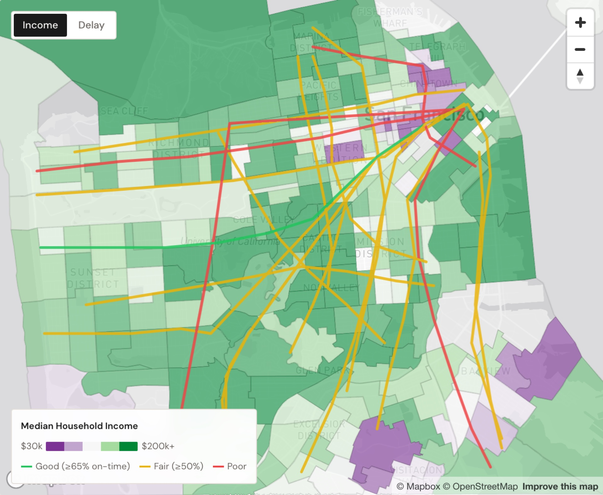
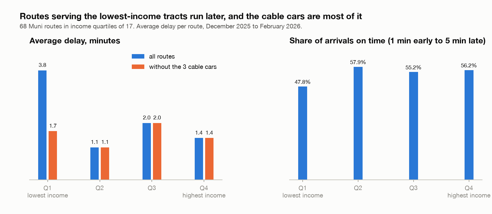
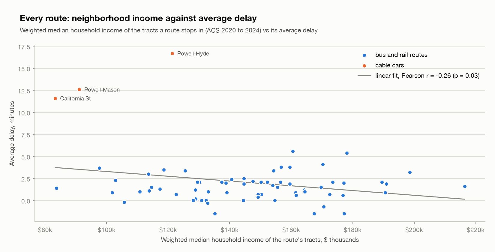
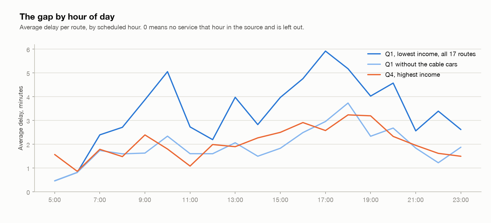
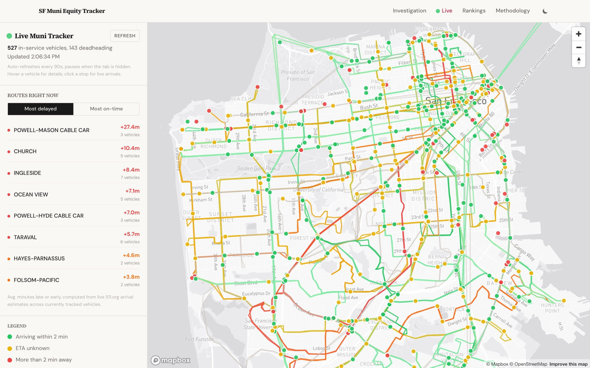

# SF Muni Equity Tracker

Does Muni run late more often in San Francisco's poorer neighborhoods? I joined 3 months of observed arrival times for every Muni route to the median household income of the census tracts each route serves, then put the answer on a map. There's also a live tracker that shows where every bus is right now.

Live at https://sf-muni-equity.vercel.app.



## The question

SFMTA designates 16 routes as equity routes. I wanted to know whether the routes through low-income neighborhoods actually run later than the rest, measured from every scheduled arrival rather than the agency's own summary. The short answer is yes on the averages, and most of that gap is 3 cable cars.

## The numbers

68 routes, 28.7 million stop observations, December 2025 through February 2026. Each route gets a weighted median income from the tracts its stops fall in, then the routes are split into income quartiles of 17. On time means between 1 minute early and 5 minutes late, which is the SFMTA standard.

| | routes | average delay | on time |
|---|---|---|---|
| Q1, lowest income | 17 | 3.8 min | 47.8% |
| Q2 | 17 | 1.1 min | 57.9% |
| Q3 | 17 | 2.0 min | 55.2% |
| Q4, highest income | 17 | 1.4 min | 56.2% |
| All routes | 68 | 2.1 min | 54.3% |
| SFMTA equity routes | 16 | 1.5 min | 53.7% |



## What holds up and what doesn't

The headline gap is real on the means. The lowest quartile runs about 2.6 times the delay of the highest, and the Pearson correlation between income and delay is negative and significant (r = -0.26, p = 0.03). An OLS model with stop count and a rapid-route flag as controls keeps income significant (p = 0.04): every $10,000 less in neighborhood income adds about 16 seconds of average delay per route.

It gets weaker once you look past the means though. Spearman rank correlation isn't significant (p = 0.59), and neither Mann-Whitney between the top and bottom quartile (p = 0.13) nor Kruskal-Wallis across all 4 (p = 0.34) reaches significance. The random forest doesn't generalize at all under cross-validation, so its feature importances (income at 74%) shouldn't be read as more than a hint.



The biggest reason is the cable cars. Powell-Hyde, Powell-Mason and California are the 3 most delayed routes in the data at 17, 13 and 12 minutes, and all 3 land in the lowest-income quartile because their tracts are downtown and Chinatown. Drop them and the lowest quartile averages 1.7 minutes against 1.4 for the highest. Still a gap, but a small one. The home page's worst-routes table already excludes cable cars for this reason; the quartile stats at the top of it don't, and that's the honest number to argue about.



By hour of day the same thing shows up. With the cable cars in, the lowest quartile peaks near 6 minutes of delay at 5pm. Without them it tracks the highest quartile within about a minute all day, and the two lines cross more than once. The evening peak is a bit worse on the low-income routes (3.7 against 3.2 minutes at 6pm), and that's about all the hourly data supports.

The other limits are the ones you'd expect: 3 months can't show seasonality, a 5-year ACS estimate blurs neighborhoods that changed, and one route can run through both the richest and poorest tracts in the city, so a route-level income is a blunt instrument. Income also travels with traffic density and ridership, which this doesn't control for.

## How it's built

```
511.org GTFS archives              Census ACS B19013            TIGER/Line 2024 tracts
(3 months of stop_observations)    (median income per tract)    (polygons, county 075)
        |                                 |                            |
  01 download    02 keep Muni        04 fetch                          |
        |                                 |                            |
  03 point-in-polygon join, every stop to its tract (DuckDB) <---------+
        |
  05 delay = observed minus scheduled arrival, plus the on-time flag
        |
  06 per-route stats: delay, on-time share, delay by hour and weekday, weighted income, quartile, rank
        |
  07 models: Pearson, Spearman, Mann-Whitney, Kruskal-Wallis, OLS, random forest, 4-quadrant classification
        |
  08 export routes.json, tract and route GeoJSON, model summaries -> site/
        |
  Vite + React + Mapbox GL site on Vercel
  2 serverless functions proxy 511.org for the live map, so the key never reaches the browser
```

`pipeline/` is 8 numbered Python scripts run in order by `run_pipeline.py`. `site/` has 4 pages: Home (the story, choropleth, scatter and worst routes), Live, Rankings, Methodology. The Live page polls `/api/vehicles` every 90 seconds, which matches the `s-maxage=90` cache header on the function, and `/api/predictions` wraps StopMonitoring for one stop.



| Tool | What it does here |
|---|---|
| Python 3, pandas, GeoPandas, Shapely | parse the GTFS archives, read the tract shapefile, per-route stats |
| DuckDB | the point-in-polygon join and the hourly aggregates over 28.7M rows |
| SciPy, statsmodels, scikit-learn | correlation tests, OLS, random forest |
| React 19, Vite, Tailwind 4 | the site |
| Mapbox GL | choropleth, route lines, live vehicles |
| Vercel | hosting and the 2 serverless functions in `site/api/` |

`docs/charts.py` redraws the 3 charts above from `site/src/data/routes.json` (`uv run --with matplotlib python docs/charts.py`).

## Running it

Pipeline:

```
cd pipeline
python3 -m venv .venv && source .venv/bin/activate
pip install -r requirements.txt
API_KEY_511=... python run_pipeline.py
```

Raw downloads land in `pipeline/data/`, which is gitignored. The exported outputs are committed under `site/public/data/` and `site/src/data/`, so the site runs without the pipeline.

Site:

```
cd site
cp .env.example .env    # fill in VITE_MAPBOX_TOKEN
npm ci
npm run dev             # pages only, /api/* 404s
vercel dev              # full stack with the live tracker
```

Deploys are `vercel deploy --prod --yes` from `site/`. `API_KEY_511` and `VITE_MAPBOX_TOKEN` are set in the Vercel project env; nothing is wired to git.

## What I'd do with more time

- 12 months of archives instead of 3, so seasonality and the summer schedule show up.
- Ridership as a control. Income travels with density, and part of the gap might be a crowding story.
- Stop-level income instead of route-level, so a route that crosses the whole city isn't averaged into the middle.
- Headway adherence for the frequent routes. On a bus every 6 minutes, "late against the schedule" is the wrong measure.

## Data sources

- 511.org Historic Regional GTFS archives with `stop_observations.txt`, December 2025 through February 2026. https://511.org/open-data/transit
- U.S. Census Bureau ACS 5-Year Estimates 2020 through 2024, table B19013 (median household income), tract level, San Francisco County (FIPS 06075).
- Census TIGER/Line 2024 tract shapefiles, California, filtered to COUNTYFP 075.
- SFMTA equity route list and the on-time standard.
- 511.org SIRI VehicleMonitoring and StopMonitoring for the live tracker.

## License

Code is MIT (see LICENSE). The derived data in `site/public/data` and `site/src/data` is CC BY 4.0. The raw 511.org and Census sources keep their own terms.
